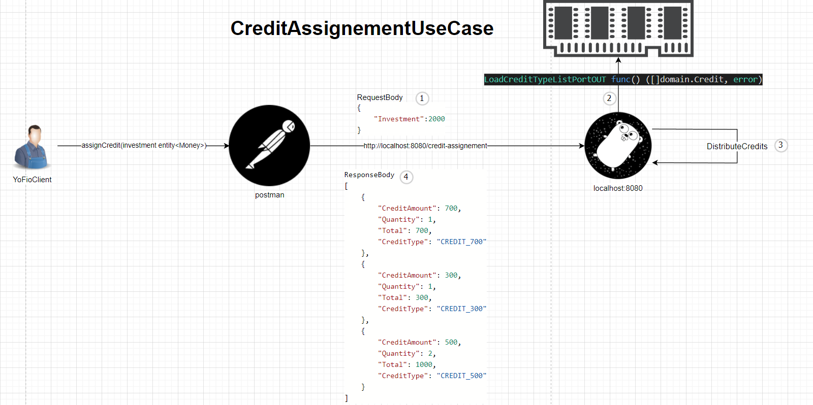

# yoFio
Caso de uso de asignación de creditos

Pasos para ejecutar la aplicación :

* Ubicado en la raiz del proyecto ejecutar : $go run main.go
* La aplicación intentará levantar en el puerto 8080 (asegurate bien de que el puerto esté desocupado)
* Importar la colección postman ubicada en la raiz del proyecto y enviar la solicitud con los la inversión a distribuir deseada
